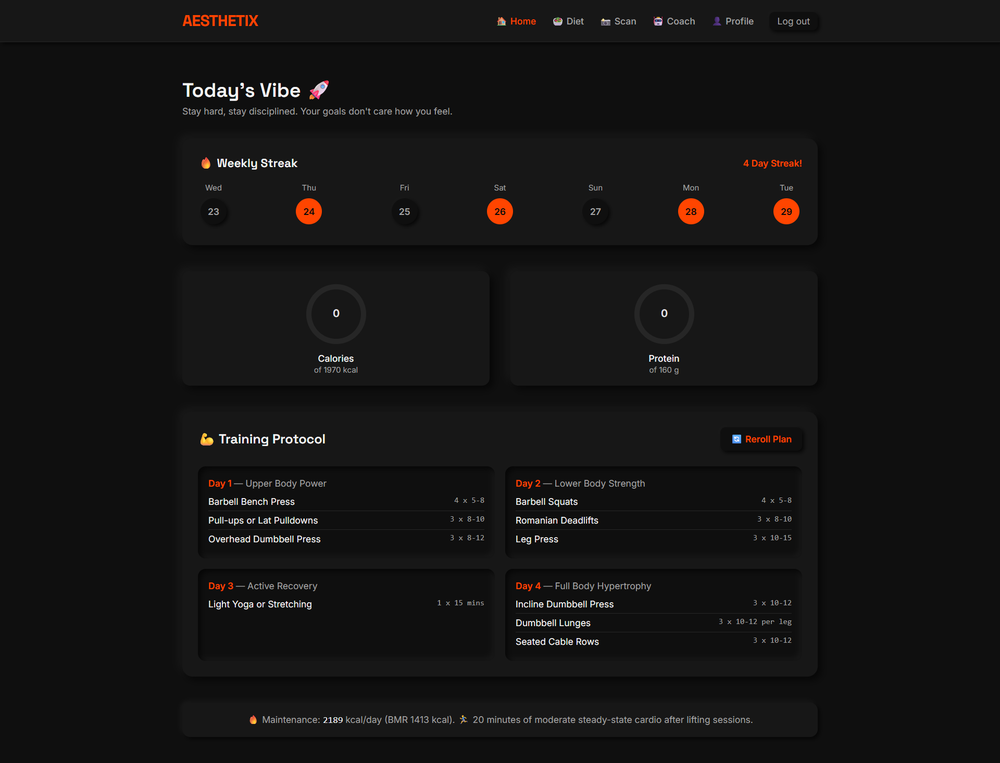
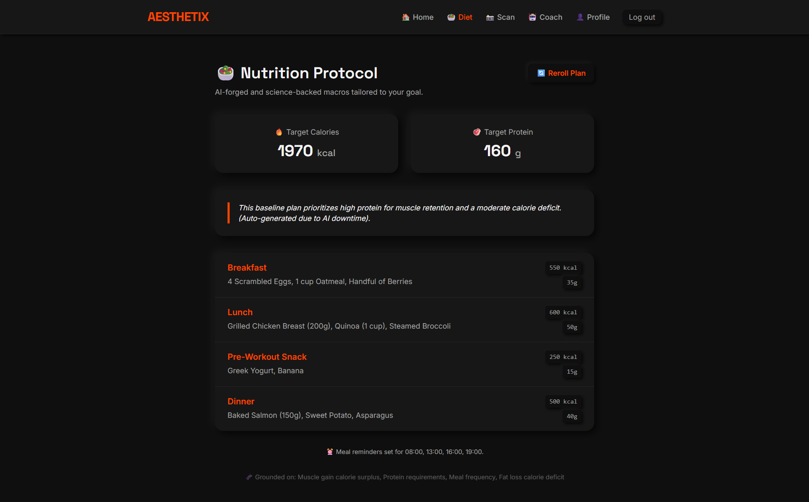
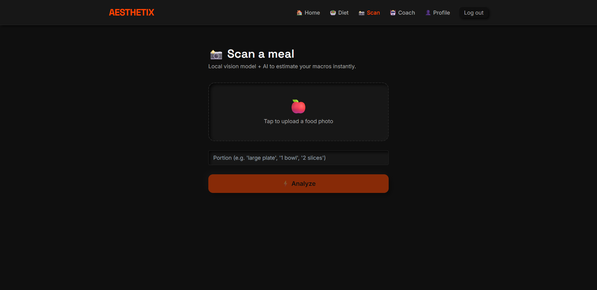
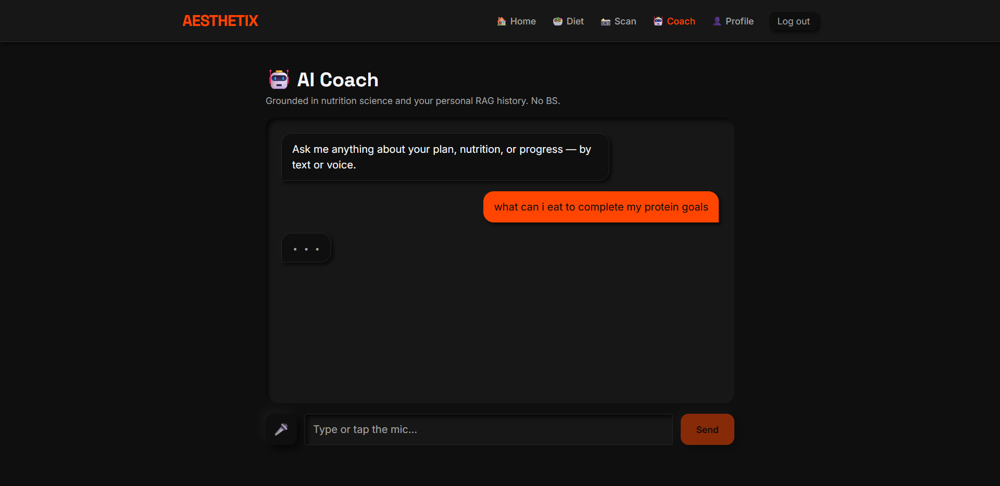

# AESTHETIX 🚀

> **AI-Forged Fitness & Nutrition Protocol**

Aesthetix is a full-stack, AI-driven fitness application built with a brutalist, dark-mode neumorphic design system. It goes beyond generic advice by combining **local, on-device Machine Learning (Vision + NLP)** with the **Gemini AI API** to provide highly personalized, RAG-grounded training protocols, diet plans, and real-time AI coaching.

 <!-- Update this path to your actual hero image -->

## ✨ Features

- **AI-Forged Training Protocols**: Generates tailored, 4-day resistance training splits based on the user's specific physiology (BMR/TDEE calculated server-side) and goals.
- **RAG-Grounded Diet Plans**: Recommends high-quality daily meal plans grounded in real nutrition science using a Retrieval-Augmented Generation (RAG) architecture.
- **Local AI Food Scanner**: Upload a photo of your meal. A local Vision Transformer (`transformers.js`) classifies the food instantly without API costs, while Gemini reasons about your text-based portion size to accurately estimate calories and macros.
- **Voice-Enabled AI Coach**: A ChatGPT-style coaching assistant that contextually understands your personal workout history and dietary restrictions using multi-corpus RAG. Features built-in voice-to-text (Web Speech API).
- **Weekly Streak & Analytics**: A beautiful, frictionless dashboard to track daily protein, caloric intake, and workout consistency.
- **Dark Neumorphic UI**: A highly motivational, distraction-free aesthetic built entirely with responsive Tailwind CSS.

---

## 📸 Screenshots

<div align="center">
  
  
</div>
<br/>
<div align="center">
  
  
</div>
<div align="center">
  <em>(Replace the paths above with the actual screenshot filenames from your `docs/` folder)</em>
</div>

---

## 🏗️ Architecture & Tech Stack

Aesthetix uses a modern **MERN-with-Firebase** stack, carefully designed to showcase production-ready AI engineering patterns: **combining hosted LLMs with local ML inference and RAG pipelines.**

- **Frontend**: React, Vite, Tailwind CSS, React Router
- **Backend**: Node.js, Express
- **Database & Auth**: Firebase Firestore, Firebase Authentication
- **AI / LLMs**: Google Gemini API (1.5 Flash)
- **Local ML**: `@xenova/transformers` (running ViT for image classification and MiniLM for vector embeddings directly on the Node server).

### Why this architecture?

| Feature | Implementation | Engineering Value |
|---|---|---|
| **Auth & DB** | Firebase Auth + Firestore | Secure, scalable user management and NoSQL data modeling. |
| **Diet RAG Pipeline** | Local embeddings + Cosine search | Demonstrates real Retrieval-Augmented Generation without relying on expensive managed vector databases. |
| **Food Scanner** | Local `Xenova/food101` + Gemini | Shows pragmatic AI engineering: using free, fast local ML for classification, and reserving the paid LLM solely for complex reasoning (portion parsing). |
| **Personalized AI Coach** | Multi-corpus RAG | The chat coach searches both a static nutrition knowledge base *and* the user's specific Firestore logs to provide highly contextual answers. |
| **Notifications** | `node-cron` + Firebase Cloud Messaging | Demonstrates background job scheduling and push notification integration. |

---

## ⚙️ Local Setup

### 1. Firebase Configuration
1. Create a project at [Firebase Console](https://console.firebase.google.com).
2. Enable **Authentication → Email/Password**.
3. Create a **Firestore** database (start in production mode and deploy `firestore.rules`).
4. Get your web client config and place it in `client/.env`.
5. Generate a new private key for the Firebase Admin SDK and place the credentials in `server/.env`.

### 2. Gemini API
Get a free API key from [Google AI Studio](https://aistudio.google.com/) and set `GEMINI_API_KEY` in `server/.env`.

### 3. Installation

**Run the Backend:**
```bash
cd server
npm install
npm run dev
# Runs on http://localhost:5000
```

**Run the Frontend:**
```bash
cd client
npm install
npm run dev
# Runs on http://localhost:5173
```

> **Note:** The very first time you scan a meal or ask the coach a question, the server will download the local ML models (~100MB) and cache them in memory. Expect a slight delay on the first execution only.

---

## 🚀 Future Roadmap

- Swap the local in-memory vector search for a dedicated vector database (Pinecone or pgvector) as the user base scales.
- Integrate the USDA FoodData Central API to replace the static macro reference tables.
- Move `node-cron` notification scheduling to a dedicated worker queue (e.g., BullMQ) for horizontal scaling.

---
*Designed & Engineered for discipline and results.*
